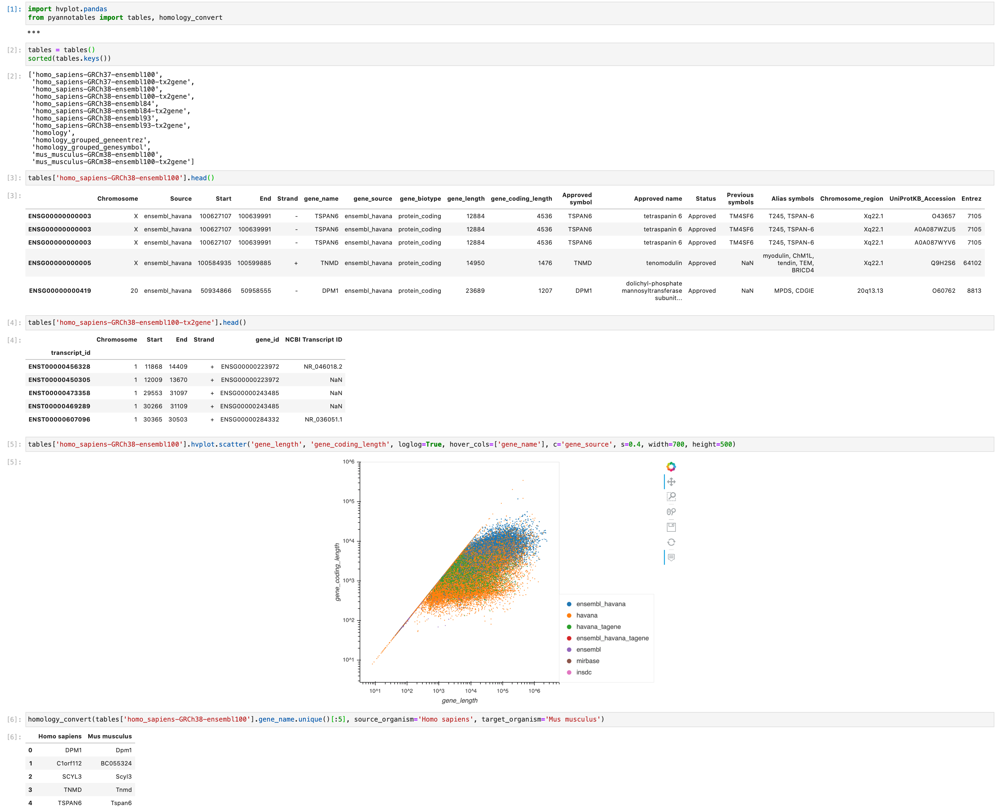

============
pyannotables
============

.. image:: https://img.shields.io/pypi/v/pyannotables.svg
        :target: https://pypi.python.org/pypi/pyannotables

Python package for conversions between ENSEMBL IDs and gene names (annotables + pyensembl)

* Free software: Apache Software License 2.0

Installation
------------

* `pip install pyannotables`

Features
--------

Credits
-------

.. _annotables package in R:  https://github.com/stephenturner/annotables
.. _pyensembl: https://github.com/openvax/pyensembl/tree/master/pyensembl
.. _Cookiecutter: https://github.com/audreyr/cookiecutter
.. _`audreyr/cookiecutter-pypackage`: https://github.com/audreyr/cookiecutter-pypackage
